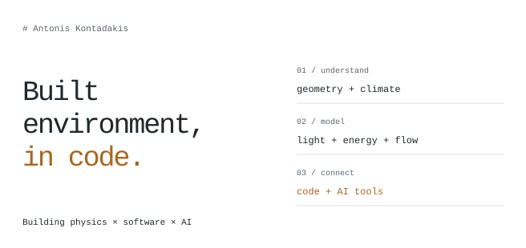

<picture>
  <source media="(prefers-color-scheme: dark) and (max-width: 600px)" srcset="assets/notebook-dark-mobile.svg">
  <source media="(max-width: 600px)" srcset="assets/notebook-light-mobile.svg">
  <source media="(prefers-color-scheme: dark)" srcset="assets/notebook-dark.svg">
  
</picture>

I build tools for daylight, lighting, building energy, and flow simulation, and explore how AI can make these workflows easier to use.

Building performance · Simulation interfaces · AI agents & MCP

### Selected work

| Tool | What it explores |
| :--- | :--- |
| [Ray Modeler ↗](https://github.com/akontadakis/Ray-Modeler) | Daylight and electric lighting workflows with Radiance. |
| [Flux Modeler ↗](https://github.com/akontadakis/Flux-Modeler) | Building energy simulation with EnergyPlus and AI assistance. |
| [hcl-mcp ↗](https://github.com/akontadakis/hcl-mcp) | Human-centric lighting and spectral simulation through MCP. |
| [whetstone-mcp ↗](https://github.com/akontadakis/whetstone-mcp) | An agent skill for measuring and improving MCP tool use. |

---

Python · JavaScript · Radiance · EnergyPlus · OpenFOAM · [Let’s connect ↗](https://www.linkedin.com/in/antonis-kontadakis-2962b79b/)
